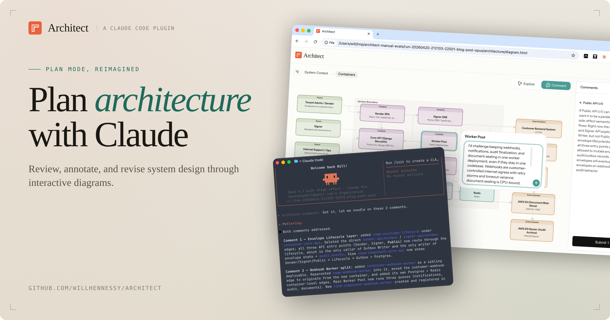

# Claude Architect

The Claude Architect plugin adds an interactive architecture diagram to Plan Mode, so you can review, annotate, and revise the plan with Claude in real time.



The planning process feels like a whiteboard session:

1. **visualize the architecture** and see relationships at a glance
2. **drill down** into containers and components to review each layer
3. **comment directly** on any node or edge
4. **review updates** from Claude in response to your comments

## Getting Started

### 1. Install the plugin

```bash
claude plugin marketplace add https://github.com/willhennessy/architect.git
claude plugin install architect@plugins
```

### 2. Start Claude

```bash
claude --dangerously-load-development-channels plugin:architect@plugins
```

### 3. Plan

1. Switch to Plan Mode
2. Run `/architect:plan` with your design prompt
3. After drafting the plan, Claude will ask if you want an interactive diagram. Say yes.
4. Open `./architecture/diagram.html` in your browser

Or if you're working in an existing repo run `/architect:init`.

## Skills

| Name                | Description                                                                                                   |
| ------------------- | ------------------------------------------------------------------------------------------------------------- |
| `architect-plan`    | Enhance Plan Mode with a visual, interactive architecture diagram.                                            |
| `architect-init`    | Generate a diagram and structured architecture files for an existing codebase.                                |
| `architect-diagram` | Render `diagram.html` from existing architecture artifacts. In normal flows you should not need to call this. |

## How it works

1. Claude generates a semantic representation of the system architecture using the [C4 model](https://c4model.com/introduction) and writes the output to structured YAML files in `./architect`
2. Claude generates SVG diagrams and injects them into an interactive HTML app at `./architect/diagram.html`
3. You open the diagram in your browser and add comments
4. Comments are sent back to Claude through a local [Channel](https://code.claude.com/docs/en/channels)
5. Claude incorporates your feedback and publishes updates to the diagram in real time
