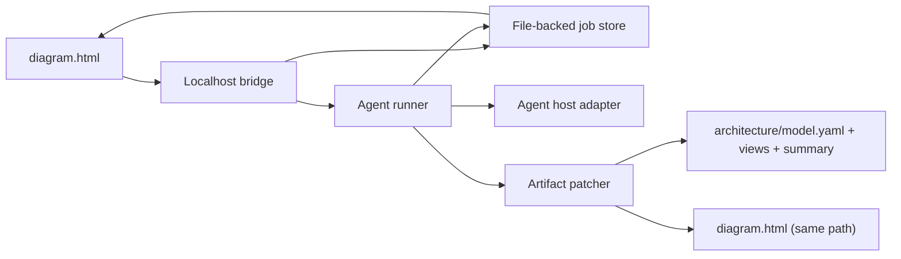

# Comment Update Loop Design

## Goal

Turn batched point-and-click diagram comments into a fast, legible architecture revision loop.

The user should be able to:

1. Submit one batch of comments from `diagram.html`
2. See immediate acknowledgement from the agent
3. Track what the agent is doing
4. Refresh the same `diagram.html` file to see updates
5. Know whether a quick patch is ready now and whether a slower follow-up is still running

## User experience contract

### UX principles

1. The user always knows the current state of the agent
2. The agent visibly acknowledges comment receipt immediately in the agent app / terminal
3. The user is notified as soon as a fast update is ready, and warned if a slower reconcile is still running
4. Viewing the update should be as simple as refreshing the same HTML file
5. Submitted comments should clear from the HTML app after a successful submit and also be gone on refresh

### UX copy contract

Use short status messages only.

- On submit accepted:
  - `Comments sent. The agent is reviewing them now.`
- When the agent acknowledges:
  - `Received 4 diagram comments. Thinking through the update now.`
- When fast patch starts:
  - `Updating the architecture and diagram now.`
- When fast patch is ready:
  - `A quick update is ready. Refresh this page to view it.`
- When slow reconcile continues:
  - `A deeper reconcile is still running. Expect another update soon.`
- When final reconcile is ready:
  - `The deeper update is ready. Refresh this page to view the latest diagram.`
- On failure:
  - `The update hit a problem. Open the agent to review the error.`

## Brick: Comment update loop

### What it is

A local job system that accepts one submitted batch of diagram comments, routes it to an agent runner, updates architecture artifacts in place, and publishes status back to both the diagram UI and the agent host.

### Why it exists

Without an explicit loop, comment handoff is manual and opaque. The user loses confidence because they do not know whether the agent received feedback, what it is doing, or when to refresh the diagram.

### How it connects

- `diagram.html` submits comment batches to a localhost bridge
- The bridge persists a durable job and emits live status
- An agent runner picks up the job and posts visible acknowledgements into the active agent host
- The runner updates architecture artifacts and rewrites `diagram.html` in place
- The diagram UI subscribes to job status and tells the user when refresh will show the new result

### Inputs and outputs

Input:

```json
{
  "system_name": "DocSign Clone",
  "output_root": "/abs/path/to/run",
  "diagram_revision_id": "rev-12",
  "comments": [
    {
      "index": 1,
      "view_id": "container",
      "element_id": "api-service",
      "relationship_id": null,
      "target_label": "API Service",
      "comment": "Split synchronous webhook handling from the API path."
    }
  ]
}
```

Output:

```json
{
  "job_id": "job_2026-04-16T14-22-51Z_a1b2",
  "state": "received",
  "message": "Comments sent. The agent is reviewing them now.",
  "status_url": "http://127.0.0.1:8765/jobs/job_2026-04-16T14-22-51Z_a1b2",
  "events_url": "http://127.0.0.1:8765/jobs/job_2026-04-16T14-22-51Z_a1b2/events",
  "diagram_path": "/abs/path/to/run/diagram.html"
}
```

### Performance envelope

- Small localized batches should usually complete the fast patch path in `10-30s`
- Medium batches should usually complete the fast patch path in `30-90s`
- Structural batches may need a slow reconcile path of `2-10 min`
- Local HTML render and validation are cheap; the main latency driver is agent reasoning and artifact patching
- The loop should optimize for fast provisional updates first, not full architectural re-planning on every batch

## Proposed architecture



## Components

### 1. Diagram app

Responsibilities:

- Queue point-and-click comments locally
- Submit one batch on `Submit`
- Clear the local queue after `202 Accepted`
- Subscribe to job status via SSE with polling fallback
- Show concise job-state banners
- Tell the user when refreshing the same file will show the updated diagram

Non-responsibilities:

- No direct file writes
- No architecture mutation logic
- No attempt to merge multiple in-flight jobs client-side

### 2. Localhost bridge

Responsibilities:

- Accept batched comment submissions
- Persist a durable job record before responding
- Immediately emit `received`
- Expose job status endpoints
- Expose job event stream
- Hand the job to the agent runner

Recommended bind:

- `127.0.0.1:8765`

### 3. File-backed job store

Purpose:

- Durability
- Recovery after bridge or agent restart
- Auditable timeline of what happened

Recommended layout under output root:

```text
<output-root>/
  architecture/
  diagram.html
  feedback-jobs/
    latest.json
    job_<id>/
      input.json
      status.json
      events.ndjson
      result.json
```

Notes:

- `latest.json` points to the most recent job relevant to this output root
- `status.json` is the single source of truth for current state
- `events.ndjson` is append-only for troubleshooting and replay

### 4. Agent runner

Responsibilities:

- Claim queued jobs one at a time per `output_root`
- Post immediate acknowledgement into the agent host
- Classify the batch by impact scope
- Run fast patch first when possible
- Decide whether slow reconcile is needed
- Emit state transitions and human-readable messages

Core rule:

- One submitted batch maps to one job
- One job runs one architecture update loop

### 5. Agent host adapter

This is the bridge between the runner and the visible agent session.

Interface:

- `acknowledge(job)`
- `announce_state(job, state, message)`
- `announce_ready(job, kind)`
- `announce_failure(job, error)`

Primary target:

- Terminal-owned agent session, where the runner can print or inject visible status immediately

Secondary target:

- Desktop agent app integration, if the app exposes a reliable input or notification surface

Important constraint:

- The transport must not depend on a private Codex- or Claude-specific API to function
- If deep host integration is unavailable, the bridge still works and the UI remains the source of truth for status

### 6. Artifact patcher

Responsibilities:

- Load the current architecture artifacts
- Resolve target IDs to affected elements, relationships, and views
- Apply structured mutations in place
- Preserve stable IDs where possible
- Rewrite `diagram.html` at the same path

Fast-path behavior:

- Touch only impacted files
- Prefer `fast` render mode
- Run lightweight validation synchronously

Slow-path behavior:

- Reconcile summary and rationale more deeply
- Rebuild SVG fragments when needed
- Run strict checks
- Emit a second ready signal when the deeper pass completes

## Job state machine

Use these states everywhere: bridge, UI, agent runner, and status files.

```text
received
acknowledged
analyzing
fast_patch_running
fast_patch_ready
slow_patch_running
completed
failed
blocked
```

### State meanings

- `received`
  - Bridge accepted and persisted the batch
- `acknowledged`
  - Agent host has visibly responded that it received the comments
- `analyzing`
  - Runner is resolving impact and choosing fast vs slow path
- `fast_patch_running`
  - Runner is updating targeted artifacts and regenerating quick outputs
- `fast_patch_ready`
  - Updated `diagram.html` is ready at the same path
- `slow_patch_running`
  - A deeper reconcile continues in the background
- `completed`
  - Final reconcile is done and the current diagram is the latest available result
- `failed`
  - Update failed
- `blocked`
  - Update needs human direction before proceeding

### UI mapping

- `received` / `acknowledged` / `analyzing`
  - Spinner + `The agent is reviewing your comments.`
- `fast_patch_running`
  - Spinner + `Updating the architecture and diagram now.`
- `fast_patch_ready`
  - Success banner + `A quick update is ready. Refresh this page to view it.`
- `slow_patch_running`
  - Info banner + `A deeper reconcile is still running. Expect another update soon.`
- `completed`
  - Success banner + `The deeper update is ready. Refresh this page to view the latest diagram.`
  - Also used for no-op feedback such as connectivity checks or simple acknowledgments when no architecture change is requested
- `blocked`
  - Warning banner + `The update needs direction before Claude can safely change the architecture.`
- `failed`
  - Error banner + `The update hit a problem. Open the agent to review the error.`

## API contract

### `POST /feedback-batches`

Purpose:

- Submit one batch of comments

Behavior:

- Validates payload shape
- Writes job files
- Responds with `202 Accepted`
- Emits `received`
- Hands job to runner

Response:

```json
{
  "job_id": "job_2026-04-16T14-22-51Z_a1b2",
  "state": "received",
  "message": "Comments sent. The agent is reviewing them now.",
  "status_url": "/jobs/job_2026-04-16T14-22-51Z_a1b2",
  "events_url": "/jobs/job_2026-04-16T14-22-51Z_a1b2/events",
  "diagram_path": "/abs/path/to/run/diagram.html"
}
```

### `GET /jobs/:job_id`

Returns current state snapshot.

```json
{
  "job_id": "job_2026-04-16T14-22-51Z_a1b2",
  "state": "slow_patch_running",
  "message": "A quick update is ready. A deeper reconcile is still running.",
  "refresh_hint": "Refresh the same diagram file to view the quick update now.",
  "diagram_path": "/abs/path/to/run/diagram.html",
  "submitted_comment_count": 4,
  "needs_refresh": true,
  "has_fast_result": true,
  "has_final_result": false,
  "timestamps": {
    "received_at": "2026-04-16T14:22:51Z",
    "acknowledged_at": "2026-04-16T14:22:53Z",
    "fast_patch_ready_at": "2026-04-16T14:23:14Z"
  }
}
```

### `GET /jobs/:job_id/events`

Server-sent events stream with compact events:

```text
event: state
data: {"state":"acknowledged","message":"Received 4 diagram comments. Thinking through the update now."}

event: state
data: {"state":"fast_patch_ready","message":"A quick update is ready. Refresh this page to view it.","needs_refresh":true}

event: state
data: {"state":"slow_patch_running","message":"A deeper reconcile is still running. Expect another update soon."}

event: state
data: {"state":"completed","message":"The deeper update is ready. Refresh this page to view the latest diagram.","needs_refresh":true}
```

## Update algorithm

### Step 1. Submit one batch

The UI submits all queued comments in one request.

Rules:

- Preserve original comment order
- Preserve exact IDs
- Include `output_root` and `diagram_revision_id`
- Disable `Submit` until the current request returns

### Step 2. Persist before acknowledge

The bridge writes `input.json` and `status.json` before returning `202`.

This prevents the worst failure mode: the browser thinks comments were sent when nothing durable exists.

### Step 3. Immediate visible acknowledgement

The runner posts a short visible message into the active agent host as soon as it claims the job:

- `Received 4 diagram comments. Thinking through the update now.`

This should appear in the same place the user is already watching: terminal or agent app.

### Step 4. Classify impact

The runner classifies the batch:

- `localized`
  - rename, clarify text, tweak one edge, small container move
- `cross_view`
  - add or split an element, add or reroute a relationship, touch multiple views
- `structural`
  - major boundary shift, SoR change, new subsystem, broad rationale rewrite

Classification determines whether the job:

- fast-patches only
- fast-patches now and reconciles slowly after
- skips fast patch and enters slow reconcile directly

### Step 5. Fast patch path

Use when the batch is `localized` or bounded `cross_view`.

Work:

1. Load current artifacts
2. Resolve targeted IDs to impacted files
3. Apply structured mutations in place
4. Rewrite `diagram.html` at the same path
5. Run lightweight checks
6. Emit `fast_patch_ready`

Lightweight checks:

- artifact references still resolve
- `diagram.html` renders successfully
- HTML validation passes

### Step 6. Slow reconcile path

Use when:

- the batch is structural
- the patch changed architectural rationale significantly
- summary or decision coverage is now stale
- richer SVG output needs regeneration

Work:

1. Reconcile artifacts more deeply
2. Update `summary.md` and optional `diff.yaml`
3. Regenerate richer visual assets if enabled
4. Run strict checks
5. Emit `completed`

### Step 7. Same-file refresh UX

The runner rewrites the existing `diagram.html` path in place.

Implications:

- The user keeps the same browser tab open
- The user does not need a new URL
- The correct instruction is always:
  - `Refresh this page to view the updated diagram.`

### Step 8. Clear submitted comments

Client behavior after successful `202`:

- clear the local queued comments immediately
- close the submit modal
- show job-status banner instead of queued comments

Behavior after page refresh:

- start from empty local queue
- load current diagram state only
- optionally show latest completed job banner from bridge status

## Refresh and status behavior

### When fast patch is ready

The UI should tell the user:

- `A quick update is ready. Refresh this page to view it.`

If slow reconcile is also running:

- `A deeper reconcile is still running. Expect another update soon.`

This means the user can choose either:

- refresh now to see the quick patch
- wait for the deeper reconcile to finish

### When final reconcile is ready

The UI and agent host should both say:

- `The deeper update is ready. Refresh this page to view the latest diagram.`

## Latency targets

### Fast path targets

- `p50 <= 20s`
- `p90 <= 45s`
- hard expectation message at `>30s`:
  - `This update is taking longer than usual. The agent is still working.`

### Slow path targets

- normal expectation: `1-5 min`
- long-running expectation at `>5 min`:
  - `The deeper reconcile is still running. You can keep working and refresh later.`

### Why these are realistic

- Local render and validation are sub-second in this repo
- The real variable cost is agent reasoning and artifact patching
- Therefore the design should optimize for patching touched artifacts instead of regenerating the entire architecture every time

## Failure handling

### Bridge crash after submit

Mitigation:

- Persist `input.json` and `status.json` before returning `202`

### Agent host adapter unavailable

Mitigation:

- Job still runs
- UI remains authoritative for status
- `status.json` records that host acknowledgement could not be mirrored visibly

### Fast patch fails but slow reconcile may still succeed

Policy:

- Emit `failed` only if no valid update path remains
- Otherwise emit:
  - `Quick patch failed. Falling back to a deeper reconcile.`

### New submit while a job is running

V1 policy:

- Allow a second batch to queue as a new job
- Show:
  - `Another update is already running. Your comments are queued next.`

This avoids implicit merging across separate user submits.

## Implementation phases

### Phase 1

- Localhost bridge
- File-backed jobs
- SSE status stream
- Agent runner with terminal-host acknowledgement
- Fast patch path
- Same-file refresh UX

### Phase 2

- Slow reconcile path with richer visual regeneration
- Desktop host adapters
- Better impact classification
- Latest-job banner on page load

### Phase 3

- Job cancellation
- Coalescing queued jobs when safe
- More structured mutation types

## Open questions

- Should the bridge own the agent session lifecycle, or only push work into an already-running session?
- Should `summary.md` always update on fast patch, or only on slow reconcile when decisions actually changed?
- Should the UI auto-poll `latest.json` on load to show status from work triggered in another tab?

## Recommendation

Build V1 around a localhost bridge, file-backed jobs, SSE status updates, and a runner that overwrites the same `diagram.html` path in place.

That combination best satisfies the desired UX:

- immediate acknowledgement
- clear state visibility
- one batch equals one update loop
- fast patch first
- slow reconcile second when needed
- refresh the same file to see the result
