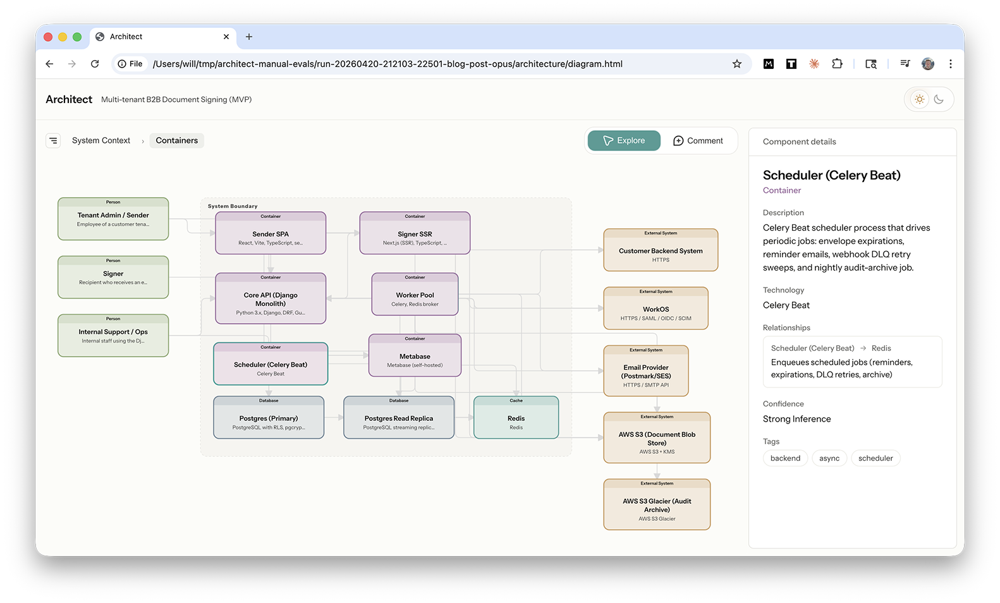

<div align="center">

<h1>Architect Comments Channel</h1>

<p><strong>Advanced bare-server path for debugging comment handoff without the plugin wrapper</strong></p>

<p>This is the expert-mode transport for people who want to inspect the raw channel flow, MCP wiring, and localhost bridge behavior directly.</p>

<p>
  <a href="../../../../README.md"><strong>Repo overview</strong></a>
  ·
  <a href="../../../../claude-plugin/architect/README.md"><strong>Primary plugin runtime</strong></a>
  ·
  <a href="#getting-started"><strong>Getting started</strong></a>
</p>

</div>



Use this when you are debugging the transport layer itself. If you just want Architect to work inside Claude Code, start with the packaged plugin runtime instead. The plugin is the primary product path. This channel server is the "show me the pipes" path.

## When You Actually Want This

- You are debugging channel delivery outside the plugin wrapper
- You want to inspect the localhost bridge and job handoff directly
- You are validating MCP behavior during development
- You want a known-good bare-server setup for regression work

If none of those sound like your day, use the plugin guide instead: [`claude-plugin/architect/README.md`](../../../../claude-plugin/architect/README.md).

## Getting Started

### 1. Install the local dependency

From this directory:

```bash
npm install
```

### 2. Write a temporary MCP config

From the repo root:

```bash
REPO_ROOT=$(pwd)
cat > /tmp/architect-channel-mcp.json <<EOF
{
  "mcpServers": {
    "architect-comments": {
      "command": "node",
      "args": [
        "${REPO_ROOT}/skills/architect-diagram/channels/architect-comments/channel.mjs"
      ],
      "env": {
        "ARCHITECT_CHANNEL_PORT": "8788"
      }
    }
  }
}
EOF
```

### 3. Start the bridge in Claude handoff mode

```bash
REPO_ROOT=$(pwd)
python3 "$REPO_ROOT/skills/architect-diagram/scripts/comment_feedback_bridge.py" \
  --claude-channel-url http://127.0.0.1:8788/notify \
  --channel-handoff-only
```

### 4. Start Claude with the development channel enabled

```bash
claude \
  --mcp-config /tmp/architect-channel-mcp.json \
  --strict-mcp-config \
  --dangerously-load-development-channels server:architect-comments \
  --permission-mode auto \
  --append-system-prompt "When an architect-comments channel event arrives, treat the channel text as the user-visible acknowledgment, call update_feedback_status with state=acknowledged without sending a second acknowledgment message in chat, inspect the referenced job and output root from the channel metadata, implement the requested updates directly, use update_feedback_status for progress, use finalize_feedback_update instead of guessing render commands, and do not stop after proposing a plan unless you are blocked or the feedback is genuinely ambiguous or high-risk."
```

### 5. Verify the connection

Inside Claude:

1. Approve the development channel prompt.
2. Run `/mcp`.
3. Confirm `architect-comments` is connected before submitting comments.

### 6. Submit comments from `architecture/diagram.html`

Expected behavior:

1. The bridge prints the immediate acknowledgment.
2. Claude receives an `architect-comments` channel event in the same live session.
3. Claude reports progress through `update_feedback_status`.
4. Claude finalizes through `finalize_feedback_update`.
5. The browser tells you to refresh the same `architecture/diagram.html`.

## Exposed MCP Tools

- `update_feedback_status` - sends acknowledged, analyzing, ready, completed, blocked, or failed updates back to the bridge
- `finalize_feedback_update` - rerenders `architecture/diagram.html`, preserves the bridge URL when provided, and validates the generated HTML before Claude marks the job done

## Known-Good Notes

- Use `--dangerously-load-development-channels server:architect-comments`
- Do **not** also pass `--channels server:architect-comments`
- Use `--permission-mode auto`, not `plan`
- `claude --help` may not list every Channels-related flag
- Claude can still print a misleading startup warning about no MCP server configured with that name; if `/mcp` shows the server connected, you are good

## Manual Configuration

If you want to wire Claude manually, point an MCP config at `channel.mjs`:

```json
{
  "mcpServers": {
    "architect-comments": {
      "command": "node",
      "args": [
        "/ABSOLUTE/PATH/TO/skills/architect-diagram/channels/architect-comments/channel.mjs"
      ],
      "env": {
        "ARCHITECT_CHANNEL_PORT": "8788"
      }
    }
  }
}
```

Then start Claude with:

```bash
claude \
  --mcp-config /ABSOLUTE/PATH/TO/mcp.json \
  --dangerously-load-development-channels server:architect-comments
```

## Prefer The Plugin For Normal Use

The packaged plugin is the supported path because it keeps the runtime, comment loop, and Claude session setup in one place. Reach for this bare-server path when you are debugging the machinery, not when you are trying to be productive.
